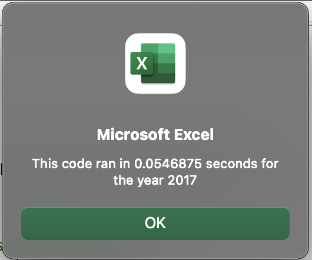
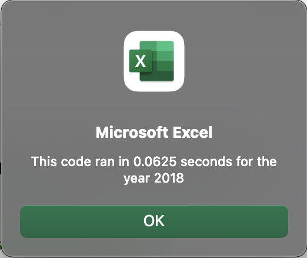

# stock-analysis.
## Overview of Project
Refactoring code to have a more efficent code. Improving performance on the existing code.
 & 
### Results
The green stocks sheet for 2017 ran in .2578125 seconds and the 2018 sheet ran in .25 seconds.
The green stocks sheet 2017 refactored, ran .0546875 seconds and the 2018 ran for .0625 seconds.
The refactored code proved it more efficent.
## Summary
The pros to refactoring code in general could mean a more efficent code with performance. In the case of the green stocks sheet it proved it to help create a better flowing faster performance. The downside to refactoring code could be downtime, and if not done correctly could mean slower performance. The case for the green stocks refactored seems to work out in our favor.
